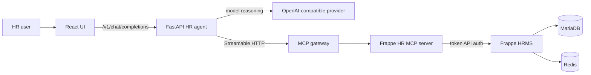
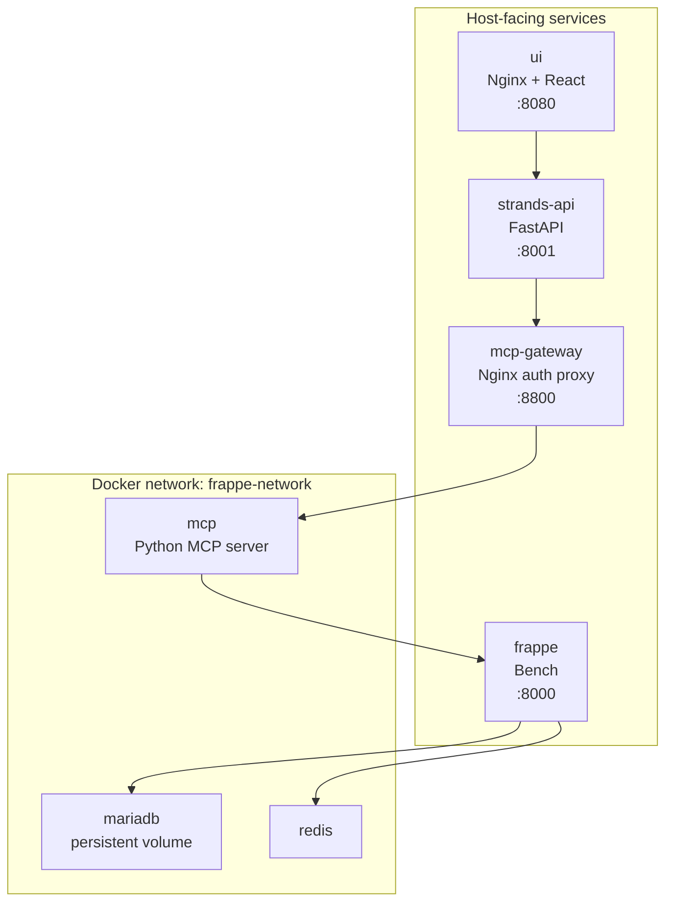
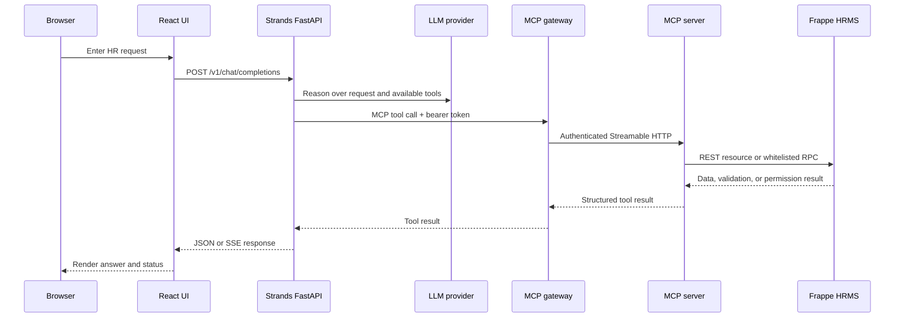
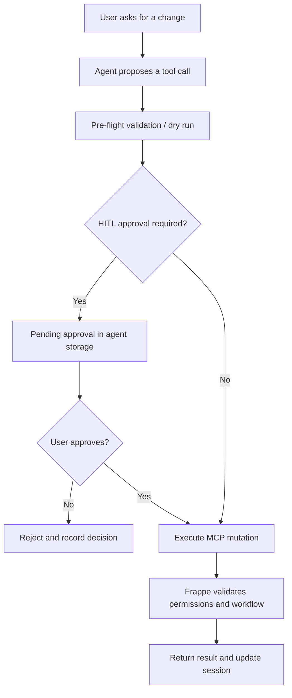
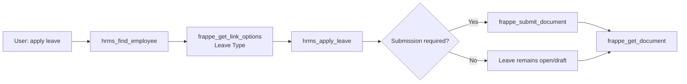

# Architecture and system flows

## What the system is

The suite is an orchestration layer around Frappe HRMS. It does not maintain a
second HR database. The browser talks to the HR agent API, the agent discovers
and calls MCP tools, and the MCP server calls Frappe's REST and RPC APIs.

## Production Compose topology

The host mappings are configurable. In a hardened deployment, expose only the
UI through an external reverse proxy and keep the API, MCP, and Frappe mappings
private.

## Request flow: chat and tool use

## Request flow: approved mutation

Writes are governed by the agent's approval layer when HITL is enabled.

Frappe is still the final authority. Agent approval does not bypass Frappe
permissions, mandatory fields, document state, or workflow rules.

## Service responsibilities

| Layer | Responsibility | Does not own |
| --- | --- | --- |
| UI | Chat, approvals, sessions, health display | Model credentials or HR persistence |
| HR agent | Orchestration, specialist selection, streaming API, HITL | Frappe authorization or database |
| MCP gateway | Network boundary and bearer-token check | Frappe business logic |
| MCP server | Tool registration, input validation, Frappe client calls | Agent reasoning |
| Frappe HRMS | HR records, permissions, validation, workflows, audit history | LLM behavior |
| MariaDB/Redis | Frappe persistence and runtime services | Agent session semantics |

## Important boundaries and fallbacks

- `FRAPPE_MCP_MODE=production` omits destructive delete and bulk-create tools.
- `admin` mode exposes additional tools but does not grant Frappe permissions.
- The agent can start when MCP is temporarily unavailable, but tool-backed
  operations are not reliable until the MCP connection is restored.
- There is no local transaction or rollback across multiple Frappe API calls.
- Bulk operations are sequential and can leave partial results.
- Frappe API credentials belong to the MCP server, not the browser.

## Typical leave request

`hrms_apply_leave` creates the Leave Application. Submission is a separate,
deliberate workflow operation.
