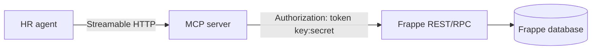
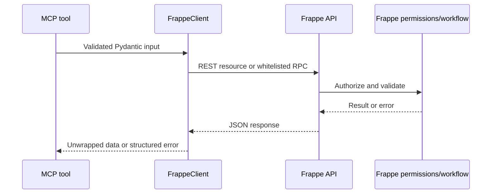

# MCP and Frappe integration

## Role of the MCP server

MCP (Model Context Protocol) exposes typed tools to the HR agent. The MCP
server does not store HR data or implement a second permission system; it
validates input, calls Frappe, and returns structured results.



## Authentication layers

There are two separate credentials:

1. `MCP_BEARER_TOKEN` protects the Nginx gateway from the agent.
2. `FRAPPE_API_KEY` and `FRAPPE_API_SECRET` authenticate the MCP server to
   Frappe using `Authorization: token key:secret`.

Never send Frappe credentials or the MCP token to the browser.

## Modes

| Mode | Available capabilities |
| --- | --- |
| `production` | Discovery, reads, creates, updates, HR helpers, submit, cancel, history |
| `admin` | Production capabilities plus delete and sequential bulk create |

Admin mode does not bypass Frappe permissions and should be limited to controlled
setup or migration windows.

## Tool groups

| Group | Examples |
| --- | --- |
| Discovery | `hrms_list_doctypes`, `frappe_get_doctype_schema`, `frappe_get_link_options` |
| Documents | `frappe_list_documents`, `frappe_get_document`, `frappe_create_document`, `frappe_update_document` |
| Workflow | `frappe_submit_document`, `frappe_cancel_document`, `frappe_get_document_history` |
| Leave | `hrms_find_employee`, `hrms_get_leave_balance`, `hrms_apply_leave` |
| Attendance | `hrms_get_attendance`, `hrms_mark_attendance` |
| Payroll | `hrms_get_salary_slips` |
| Dataset | `hrms_verify_dataset` |

## Safe write sequence

```text
1. Discover the DocType.
2. Read its schema.
3. Resolve linked values such as Department or Leave Type.
4. Create or update the document.
5. Confirm the returned document name and read the document back from Frappe.
6. Submit separately when required.
7. Read the result or history for confirmation.

Approval execution is fail-closed: an unavailable MCP gateway, invalid schema
payload, Frappe error, missing created document name, or failed read-back
verification marks the approval as `FAILED`; it is never reported as a
successful or simulated write.
```

`hrms_apply_leave` creates a Leave Application but does not submit it. Generic
bulk creation is sequential and is not transactional; earlier records remain if
a later record fails.

## Transports

### Streamable HTTP

The integrated stack uses:

```text
HR agent -> http://mcp-gateway:8800/mcp -> mcp:8800
```

The gateway checks `Authorization: Bearer <MCP_BEARER_TOKEN>`. Put the gateway
behind TLS and an access-controlled reverse proxy before exposing it publicly.

### Stdio

Desktop MCP clients can launch the server directly:

```bash
cd mcp
.venv/bin/python run.py --mode production
```

Use absolute paths and inject the Frappe environment through the client process
environment or a protected `.env` file.

## Frappe data flow



## Read-only smoke test

After connecting an MCP client:

1. Call `hrms_list_doctypes`.
2. Call `frappe_get_doctype_schema` for `Employee`.
3. Call `frappe_get_link_options` for `Department`.
4. Call `frappe_list_documents` for `Employee` with `limit: 1`.

Expected results are a registry, Employee metadata, Department options, and
zero or one Employee record without authentication or permission errors.

## Existing detailed references

The original component references remain useful for implementation-level detail:

- [`mcp/docs/process.md`](../mcp/docs/process.md)
- [`mcp/docs/setup.md`](../mcp/docs/setup.md)
