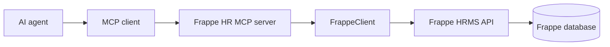
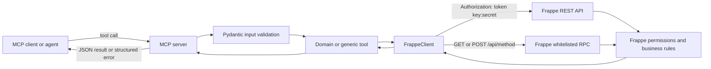

# Frappe HRMS MCP Server

An MCP server that exposes a Frappe or Frappe HRMS instance as tools for AI
agents. It uses Frappe's standard REST API and whitelisted RPC methods; it does
not install or modify a Frappe app and does not maintain a separate database.

## Documentation

- [Setup guide](docs/setup.md): Docker, Frappe credentials, MCP configuration,
  stdio setup, Streamable HTTP setup, smoke tests, and troubleshooting.
- [Process walkthrough](docs/process.md): how MCP, the Python server,
  `FrappeClient`, Frappe HRMS, and the database work together.

## Capabilities

The server provides:

- HRMS DocType discovery and schema inspection
- Link-field option lookup
- Generic document list, get, create, and update operations
- Document submission, cancellation, and timeline lookup
- Employee search
- Leave balance lookup and leave application creation
- Attendance lookup and attendance creation
- Salary slip lookup
- HR dataset verification with leave, attendance, compensation, and potential LOP metrics

The server has two modes:

| Capability               | Production | Admin |
| ------------------------ | ---------- | ----- |
| Discovery, schema, links | Yes        | Yes   |
| Read, create, update     | Yes        | Yes   |
| Submit, cancel, history  | Yes        | Yes   |
| HR helpers               | Yes        | Yes   |
| Delete documents         | No         | Yes   |
| Bulk document creation   | No         | Yes   |

is intended for controlled setup or migration work. Neither mode bypasses
Frappe permissions.

## Quick Start

Install dependencies:

```bash
python3 -m venv .venv
.venv/bin/python -m pip install -r requirements.txt
```

Then follow the [setup guide](docs/setup.md) for the complete Docker and MCP
configuration steps.

## Request Flow



The MCP server validates tool input with Pydantic, sends authenticated REST or
RPC requests through `FrappeClient`, and returns JSON results or structured
errors. Frappe remains responsible for permissions, field validation,
workflows, and persistence.

## Important Behavior

- `hrms_apply_leave` creates a Leave Application; submission is a separate
  `frappe_submit_document` operation.
- Admin bulk creation sends one request per document and is not transactional.
- API credentials belong on the MCP server and should be supplied through
  environment variables or a protected `.env` file.
- Streamable HTTP should be protected by TLS, authentication, and network
  restrictions before being exposed outside a trusted local environment.

## Project Layout

| Path                     | Responsibility                               |
| ------------------------ | -------------------------------------------- |
| `run.py`               | CLI entry point and transport startup        |
| `mcpp/server.py`       | MCP server creation and tool registration    |
| `mcpp/client.py`       | Frappe REST and RPC communication            |
| `mcpp/config.py`       | Environment configuration                    |
| `mcpp/tools/`          | Discovery, CRUD, workflow, and HR tools      |
| `mcpp/tools/schema.py` | Pydantic tool input models                   |
| `mcpp/doctypes.py`     | Curated HRMS DocType registry                |
| `docker/`              | Local Frappe, MariaDB, and Redis setup       |
| `docs/process.md`      | Detailed execution and data-flow explanation |
| `docs/setup.md`        | Installation and connection instructions     |

# Frappe HRMS Model Context Protocol (MCP) Server

MCP server exposing any Frappe / Frappe HRMS instance as tools for LLM agents.
Operates over Frappe's standard REST API and whitelisted RPC methods — no app modifications required.

---

# Frappe HRMS MCP Server

An MCP server that exposes a Frappe or Frappe HRMS site to an MCP-compatible
client. It provides schema discovery, generic document operations, workflow
actions, and focused HR helpers. The server does not modify the Frappe site or
install a Frappe app; it calls Frappe's REST resources and whitelisted RPC
methods using an API key and secret.

## What This Server Does

The Python process registers MCP tools with the selected transport. Each tool
validates its input with Pydantic, calls the Frappe API through the shared
`FrappeClient`, and returns JSON text to the MCP client. Frappe remains the
source of truth for permissions, validation, workflows, and stored data.



### Request paths

- Generic documents use `/api/resource/<DocType>` for list, get, create,
  update, and admin-only delete operations.
- Schema discovery uses the whitelisted
  `frappe.desk.form.load.getdoctype` method, with a DocType resource fallback.
- Leave-balance lookup calls the HRMS method
  `hrms.hr.doctype.leave_application.leave_application.get_leave_balance_on`.
- All requests use the configured timeout and the Frappe token header.

## Operating Modes

The server has two modes. Mode controls which MCP tools are registered; it does
not bypass Frappe permissions.

| Capability                       | Production     | Admin      |
| -------------------------------- | -------------- | ---------- |
| Discovery, schema, links         | Yes            | Yes        |
| Read, create, update             | Yes            | Yes        |
| Submit, cancel, history          | Yes            | Yes        |
| HR helpers                       | Yes            | Yes        |
| `frappe_delete_document`       | Not registered | Registered |
| `frappe_bulk_create_documents` | Not registered | Registered |

Production is the default and is the recommended mode for routine agents.
Admin mode is intended for controlled setup or migration work. Bulk creation is
implemented as a sequence of individual create requests; it is not a single
transaction and may return both successes and errors.

## Tool Reference

### Discovery

| Tool                          | Behavior                                                                                                                  |
| ----------------------------- | ------------------------------------------------------------------------------------------------------------------------- |
| `hrms_list_doctypes`        | Lists the curated HRMS DocType registry, optionally by category.                                                          |
| `frappe_get_doctype_schema` | Returns field names, labels, field types, required flags, defaults, link options, and whether the DocType is submittable. |
| `frappe_get_link_options`   | Lists existing names from a target DocType, with optional substring search.                                               |

The registry contains 54 curated HRMS DocTypes across Core HR, Attendance &
Shifts, Leave Management, Payroll, Expenses & Travel, Recruitment, and
Lifecycle. Schema lookup can also inspect a DocType outside that registry.

### Generic documents and workflows

| Tool                             | Behavior                                                                                   |
| -------------------------------- | ------------------------------------------------------------------------------------------ |
| `frappe_list_documents`        | Lists any DocType with fields, filters, ordering, and pagination.                          |
| `frappe_get_document`          | Fetches one document, including child tables returned by Frappe.                           |
| `frappe_create_document`       | Creates a document and returns the created record.                                         |
| `frappe_update_document`       | Updates supplied fields on an existing document.                                           |
| `frappe_submit_document`       | Updates`docstatus` to `1`. Frappe decides whether submission is valid.                 |
| `frappe_cancel_document`       | Updates`docstatus` to `2`. Frappe decides whether cancellation is valid.               |
| `frappe_get_document_history`  | Lists`Comment` records associated with a document, up to 50 entries.                     |
| `frappe_delete_document`       | Permanently deletes a document; Admin mode only.                                           |
| `frappe_bulk_create_documents` | Creates documents sequentially and reports per-item successes and errors; Admin mode only. |

### HR helpers

| Tool                       | Behavior                                                                                                                                              |
| -------------------------- | ----------------------------------------------------------------------------------------------------------------------------------------------------- |
| `hrms_find_employee`     | Searches employee name, then employee ID, then company email. The default status filter is`Active`.                                                 |
| `hrms_get_leave_balance` | Reads submitted Leave Allocations and queries HRMS for each leave type's balance.                                                                     |
| `hrms_apply_leave`       | Creates a Leave Application with status`Open`; it does not submit it.                                                                               |
| `hrms_get_attendance`    | Lists non-cancelled attendance for one employee and date range.                                                                                       |
| `hrms_mark_attendance`   | Creates an Attendance record with status and optional working hours.                                                                                  |
| `hrms_get_salary_slips`  | Lists non-cancelled Salary Slips with optional employee and date filters.                                                                             |
| `hrms_verify_dataset`    | Reads employees and related records, then reports allocation, leave utilization, attendance, salary-base, and potential LOP metrics for a date range. |

## Prerequisites

- Python 3.10 or newer is recommended.
- A reachable Frappe or Frappe HRMS site.
- An API user with only the DocType and action permissions required by the
  tools you intend to expose.
- Dependencies installed from [`requirements.txt`](requirements.txt).

Install into a virtual environment:

```bash
python3 -m venv .venv
.venv/bin/python -m pip install -r requirements.txt
```

## Configuration

Set these environment variables or put them in a `.env` file in the project
root (the current working directory is checked first):

```ini
FRAPPE_BASE_URL=https://erp.example.com
FRAPPE_API_KEY=your_api_key
FRAPPE_API_SECRET=your_api_secret
FRAPPE_MCP_MODE=production
FRAPPE_REQUEST_TIMEOUT=30
```

| Variable                   | Default                   | Description                                                         |
| -------------------------- | ------------------------- | ------------------------------------------------------------------- |
| `FRAPPE_BASE_URL`        | `http://localhost:8000` | Frappe site base URL; trailing slash is removed.                    |
| `FRAPPE_API_KEY`         | Empty                     | API key used in the token authorization header.                     |
| `FRAPPE_API_SECRET`      | Empty                     | API secret paired with the key.                                     |
| `FRAPPE_MCP_MODE`        | `production`            | Default mode; any value other than`admin` resolves to production. |
| `FRAPPE_REQUEST_TIMEOUT` | `30.0`                  | HTTP timeout in seconds.                                            |

The CLI `--mode` argument overrides `FRAPPE_MCP_MODE`. The CLI `--http` and
`--port` options select Streamable HTTP and its listening port; the default
port is `8800`.

## Run It

### Local stdio transport

```bash
.venv/bin/python run.py
.venv/bin/python run.py --mode admin
```

Stdio is the default and is suitable for desktop clients that launch the
server process. The process reads MCP messages from stdin and writes protocol
output to stdout.

### Streamable HTTP transport

```bash
.venv/bin/python run.py --http --port 8800
.venv/bin/python run.py --http --mode admin --port 8801
```

Place HTTP behind TLS and an authenticated, access-controlled reverse proxy
when it is reachable outside a trusted local network. The application itself
uses the configured Frappe API credentials for upstream calls; do not treat
the HTTP listener as an authentication boundary unless your deployment adds
one.

## MCP Client Configuration

Example stdio configuration for clients that support an `mcpServers` map:

```json
{
  "mcpServers": {
    "frappe-hr-production": {
      "command": "/absolute/path/to/mcp/.venv/bin/python",
      "args": ["/absolute/path/to/mcp/run.py", "--mode", "production"]
    },
    "frappe-hr-admin": {
      "command": "/absolute/path/to/mcp/.venv/bin/python",
      "args": ["/absolute/path/to/mcp/run.py", "--mode", "admin"]
    }
  }
}
```

Keep production and admin configurations separate. Do not place API secrets in
the client configuration; provide them through the process environment or a
protected `.env` file.

## Recommended Agent Sequence

For a write operation, an agent should:

1. Call `hrms_list_doctypes` when the exact DocType is uncertain.
2. Call `frappe_get_doctype_schema` to inspect required fields and field types.
3. Call `frappe_get_link_options` for referenced records such as Department or
   Leave Type.
4. Create or update the document.
5. Call `frappe_submit_document` separately when the business operation
   requires submission.
6. Read the resulting document or history when confirmation is needed.

The server does not infer business approvals or silently retry writes.

## Errors and Limitations

Errors are returned as JSON text. Upstream Frappe errors preserve the HTTP
status code and a safe message. Common cases include missing credentials
(`401`), permission failures (`403`), missing records (`404`), conflicts
(`409`), validation failures (`417`), connection failures (`502`), and
timeouts (`504`).

This project does not provide a local database, queue, transaction boundary,
audit store, rate limiter, or retry policy. Frappe's permissions and audit
behavior apply, but deployment owners should provide network controls,
credential rotation, monitoring, and backups appropriate to their environment.

## Production Checklist

- Use HTTPS for `FRAPPE_BASE_URL` and protect API credentials as secrets.
- Create a dedicated Frappe API user with least-privilege roles.
- Run production mode for routine agents; expose admin mode only for a short,
  controlled setup window.
- Put Streamable HTTP behind TLS, authentication, and network restrictions.
- Set an explicit `FRAPPE_REQUEST_TIMEOUT` for the deployment.
- Monitor the MCP process and the Frappe site for failed requests and permission
  errors.
- Test the exact DocTypes and HRMS version used by your site before enabling
  write tools in production.
