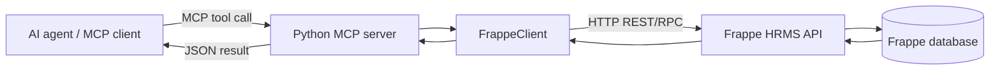
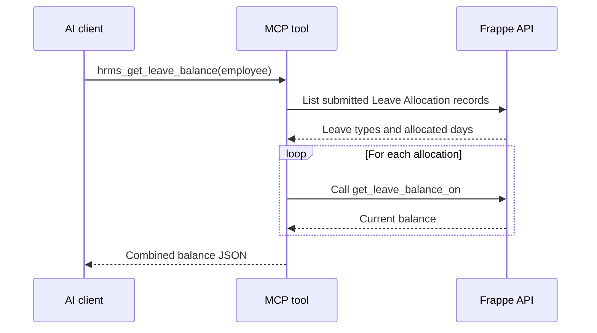

# What This Project Is

This project is a **bridge between an AI/MCP client and Frappe HRMS**.

It does not contain its own HR database or business system. Instead:



The main purpose is to let an AI agent perform operations such as:

- Find employees
- Read attendance
- Apply for leave
- Read salary slips
- Create or update Frappe documents
- Inspect DocType schemas
- Submit or cancel documents

The Frappe server remains responsible for permissions, validation, workflows, and database storage.

---

# 1. How the Program Starts

The entry point is run.py.

When you execute:

```bash
python3 run.py
```

the following happens:

1. Python parses command-line arguments.
2. It determines the mode:
   - `production`
   - `admin`
3. It calls `build_server()`.
4. It starts the MCP server using the default `stdio` transport.

```python
mcp_app = build_server(mode=args.mode)
mcp_app.run()
```

You can also start it over HTTP:

```bash
python3 run.py --http --port 8800
```

That uses:

```python
mcp_app.run(transport="streamable_http", port=args.port)
```

## Two transports

### Stdio

The MCP client launches this Python process directly.

```text
MCP client starts run.py
MCP messages go through stdin/stdout
```

This is common for desktop AI applications.

### Streamable HTTP

The MCP server listens on a network port.

```text
MCP client -> HTTP -> Python MCP server
```

For real deployments, this should be placed behind TLS and authentication.

---

# 2. Configuration Loading

Configuration is handled in mcpp/config.py.

The application looks for `.env` in:

1. The current working directory
2. The project root
3. Normal environment variables

Important values are:

```ini
FRAPPE_BASE_URL=http://localhost:8000
FRAPPE_API_KEY=...
FRAPPE_API_SECRET=...
FRAPPE_MCP_MODE=production
FRAPPE_REQUEST_TIMEOUT=30
```

The values become Python constants:

```python
FRAPPE_BASE_URL
FRAPPE_API_KEY
FRAPPE_API_SECRET
FRAPPE_REQUEST_TIMEOUT
FRAPPE_MCP_MODE
```

If `FRAPPE_MCP_MODE` is anything other than `admin`, the code uses `production`.

That means a typo such as:

```ini
FRAPPE_MCP_MODE=prod
```

still results in production mode.

---

# 3. Server Construction

The central assembly point is mcpp/server.py.

The `build_server()` function creates:

```python
mcp = MCPServer(...)
client = FrappeClient()
```

The `MCPServer` comes from the MCP Python library. It provides the protocol layer that allows an AI client to discover and call tools.

Then the server registers tool groups:

```python
register_discovery_tools(...)
register_document_tools(...)
register_workflow_tools(...)
register_leave_tools(...)
register_attendance_tools(...)
register_payroll_tools(...)
register_lifecycle_tools(...)
```

All tools share the same `FrappeClient` instance.

This is important because every tool ultimately uses the same:

- Frappe base URL
- API key
- API secret
- Timeout
- Authentication format
- Error handling

---

# 4. What MCP Does

MCP means **Model Context Protocol**.

An MCP server exposes functions called **tools** to an AI client.

For example, this Python function:

```python
@mcp.tool(name="hrms_find_employee")
async def hrms_find_employee(params: FindEmployeeInput) -> str:
```

becomes an AI-callable tool named:

```text
hrms_find_employee
```

The AI client can see:

- The tool name
- The tool description
- The expected input fields
- Which fields are required
- Field descriptions
- Whether the operation is read-only or destructive

The AI can then issue a tool call such as:

```json
{
  "name": "hrms_find_employee",
  "arguments": {
    "query": "Jane"
  }
}
```

The MCP library:

1. Receives the request.
2. Validates the input using Pydantic.
3. Calls the Python tool function.
4. Waits for the asynchronous result.
5. Sends the returned JSON text back to the AI client.

The AI does not directly call Frappe. It calls MCP tools, and those tools call Frappe.

---

# 5. Input Validation

The Pydantic models are defined in mcpp/tools/schema.py.

Examples:

```python
class MarkAttendanceInput(BaseModel):
    employee: str
    attendance_date: str
    status: Literal["Present", "Absent", "Half Day", "On Leave"]
    working_hours: Optional[float] = None
```

This means an attendance request must contain:

- An employee ID
- A date
- One of four allowed statuses

This input is rejected before reaching Frappe if the status is invalid.

The models also enforce things such as:

```python
limit: int = Field(default=20, ge=1, le=200)
```

So a caller cannot request a limit below `1` or above `200`.

Most models also use:

```python
extra="forbid"
```

That means unexpected fields are rejected instead of silently ignored.

---

# 6. The Frappe Client

The main HTTP abstraction is mcpp/client.py.

The `FrappeClient` handles communication with Frappe.

## Authentication

Every request includes:

```http
Authorization: token API_KEY:API_SECRET
```

This is generated by:

```python
_auth_header()
```

If either credential is missing, the client raises a `401`-style `FrappeAPIError`.

## Generic request flow

The client builds a URL:

```python
url = f"{self.base_url}{path}"
```

Then it uses `httpx.AsyncClient` to send the request.

For example:

```python
await client.get_list("Employee", ...)
```

eventually becomes something like:

```http
GET /api/resource/Employee
```

with query parameters such as:

```json
{
  "fields": "[\"name\", \"employee_name\"]",
  "filters": "[[\"status\", \"=\", \"Active\"]]",
  "limit_page_length": 20,
  "limit_start": 0
}
```

## REST resource operations

The client maps operations to Frappe endpoints:

| Python method | HTTP request |
|---|---|
| `get_list()` | `GET /api/resource/<DocType>` |
| `get_doc()` | `GET /api/resource/<DocType>/<name>` |
| `create_doc()` | `POST /api/resource/<DocType>` |
| `update_doc()` | `PUT /api/resource/<DocType>/<name>` |
| `delete_doc()` | `DELETE /api/resource/<DocType>/<name>` |

## RPC operations

Some Frappe functionality is exposed through methods instead of resources:

```text
/api/method/<method-name>
```

The client handles this through:

```python
call_method()
```

For example, leave balance uses:

```text
/api/method/hrms.hr.doctype.leave_application.leave_application.get_leave_balance_on
```

---

# 7. Response Handling

Frappe commonly returns responses like:

```json
{
  "data": {
    "name": "HR-EMP-00001",
    "employee_name": "Jane Smith"
  }
}
```

The client unwraps the `data` field so tool code receives the actual document.

For RPC responses, Frappe commonly returns:

```json
{
  "message": {...}
}
```

The client unwraps `message`.

The individual MCP tools then serialize the result using:

```python
json.dumps(...)
```

Therefore, the AI client generally receives JSON text.

---

# 8. Error Handling

Errors are handled in two layers.

## Client layer

The client translates HTTP failures into `FrappeAPIError`.

Examples:

| HTTP status | Meaning returned |
|---|---|
| `401` | Missing or invalid credentials |
| `403` | Permission denied |
| `404` | DocType or document not found |
| `409` | Conflict or duplicate |
| `417` | Validation failure |
| `502` | Cannot connect to Frappe |
| `504` | Request timeout |

The code also tries to extract Frappe’s useful error messages from:

- `exception`
- `_server_messages`
- `message`

## Tool layer

Each tool catches exceptions:

```python
except Exception as e:
    return err(e)
```

The `_format_error()` function in mcpp/server.py turns the exception into JSON:

```json
{
  "error": "Permission denied...",
  "status_code": 403
}
```

This makes errors easier for an AI model to understand.

---

# 9. Production and Admin Modes

The mode is controlled in mcpp/server.py.

## Production mode

Production mode registers:

- Read operations
- Create operations
- Update operations
- Submit/cancel operations
- HR helper tools

It does not register:

```text
frappe_delete_document
frappe_bulk_create_documents
```

This is a safety feature.

## Admin mode

Admin mode additionally registers:

- Permanent deletion
- Bulk creation

Admin mode does not bypass Frappe permissions. It only makes additional MCP tools available.

Frappe still decides whether the API user is allowed to perform the action.

---

# 10. Discovery Tools

Discovery tools are in:

- mcpp/tools/discovery.py
- mcpp/tools/schema.py
- mcpp/doctypes.py

## `hrms_list_doctypes`

This uses the local `HR_DOCTYPES` registry.

It does not query Frappe. It gives the AI canonical HRMS DocType names such as:

```text
Employee
Leave Application
Attendance
Salary Slip
Department
```

It also indicates whether a DocType is submittable.

## `frappe_get_doctype_schema`

This asks Frappe for metadata using:

```text
frappe.desk.form.load.getdoctype
```

It returns:

- Field names
- Labels
- Field types
- Required flags
- Defaults
- Link options
- Whether the DocType is submittable

This prevents the AI from guessing field names before creating a document.

## `frappe_get_link_options`

This looks up valid linked records.

For example, before creating an Employee, the AI can ask for valid Department names.

Internally it performs a filtered list query such as:

```text
GET /api/resource/Department
```

with a filter on `name`.

---

# 11. Generic Document Tools

Generic CRUD tools are in mcpp/tools/documents.py.

They work with almost any Frappe DocType.

## List

```text
frappe_list_documents
```

Supports:

- Fields
- Filters
- Ordering
- Pagination

Example conceptual call:

```json
{
  "doctype": "Employee",
  "fields": ["name", "employee_name", "department"],
  "filters": [["status", "=", "Active"]],
  "limit": 20
}
```

## Get

```text
frappe_get_document
```

Fetches one complete document, including child tables.

## Create

```text
frappe_create_document
```

The supplied fields are combined with the DocType:

```python
payload = {"doctype": doctype, **fields}
```

Then sent as a POST request.

## Update

```text
frappe_update_document
```

Only the supplied fields are updated.

## Delete

```text
frappe_delete_document
```

Only exists in admin mode.

## Bulk create

```text
frappe_bulk_create_documents
```

This loops over documents and creates them one at a time.

Important: it is not transactional.

If five records are requested and the fourth fails:

- The first three remain created.
- The fourth is reported as an error.
- The fifth is still attempted.

There is no rollback.

---

# 12. Workflow Tools

Workflow tools are in mcpp/tools/workflow.py.

## Submit

```text
frappe_submit_document
```

This updates:

```json
{
  "docstatus": 1
}
```

Frappe interprets that as submitting a draft document.

## Cancel

```text
frappe_cancel_document
```

This updates:

```json
{
  "docstatus": 2
}
```

Frappe decides whether cancellation is legal.

## Document history

```text
frappe_get_document_history
```

This queries the `Comment` DocType for comments connected to the target document.

It returns up to 50 records ordered newest first.

The implementation calls this “history,” but it primarily retrieves timeline comments and related communication records, not every possible Frappe version/audit record.

---

# 13. Leave Tools

Leave tools are in mcpp/tools/entity/leave.py.

## Leave balance

The process is:



The tool:

1. Finds submitted `Leave Allocation` records.
2. Extracts each leave type.
3. Calls the HRMS balance method for each type.
4. Combines allocation and balance data.

## Apply leave

```text
hrms_apply_leave
```

It creates a `Leave Application` with:

- Employee
- Leave type
- Start date
- End date
- Half-day flag
- Optional reason
- Optional half-day date

Important behavior:

The implementation only calls `create_doc()`.

It does **not** call `frappe_submit_document`.

So the actual flow is:

```text
Create Leave Application
        |
        v
Status remains Open / draft-like
        |
        v
Submit separately if required
```

The function docstring says “Create and submit,” but the implementation and README correctly indicate that it only creates the application.

---

# 14. Attendance Tools

Attendance tools are in mcpp/tools/entity/attendance.py.

## Get attendance

```text
hrms_get_attendance
```

It searches `Attendance` using:

- Employee
- Start date
- End date
- `docstatus != 2`

It returns fields such as:

- Date
- Status
- Working hours
- Shift
- Late entry
- Early exit

## Mark attendance

```text
hrms_mark_attendance
```

It creates an `Attendance` document with:

```json
{
  "doctype": "Attendance",
  "employee": "...",
  "attendance_date": "...",
  "status": "Present"
}
```

`working_hours` is optional.

Like leave creation, this helper creates the record but does not explicitly submit it.

---

# 15. Payroll Tools

Payroll tools are in mcpp/tools/entity/payroll.py.

## Salary slips

```text
hrms_get_salary_slips
```

It queries `Salary Slip` records and excludes cancelled documents:

```python
["docstatus", "!=", 2]
```

Optional filters include:

- Employee
- Start date
- End date

Returned values include:

- Gross pay
- Total deductions
- Net pay
- Salary period
- Employee name
- Document status

This tool is read-only.

---

# 16. Employee Lifecycle Tools

Lifecycle tools are in mcpp/tools/entity/lifecycle.py.

## Find employee

```text
hrms_find_employee
```

The search order is:

1. Employee name
2. Employee ID
3. Company email

The default status filter is:

```text
Active
```

The first successful search stops the fallback sequence.

For example:

```text
Search employee_name for "Jane"
If nothing found:
    Search name for "Jane"
If nothing found:
    Search company_email for "Jane"
```

The result includes:

- Employee ID
- Name
- Email
- Department
- Designation
- Status
- Joining date
- Manager

Despite the module name, this file currently contains employee search rather than complete onboarding, separation, or appraisal workflows.

---

# 17. Full Example: Applying Leave

Suppose an AI user says:

```text
Apply two days of casual leave for Jane next week.
```

A sensible MCP interaction is:

## Step 1: Find the employee

```text
hrms_find_employee
```

The tool queries Frappe’s `Employee` DocType and returns Jane’s employee ID.

## Step 2: Validate the leave type

The agent may call:

```text
frappe_get_link_options
```

with:

```json
{
  "target_doctype": "Leave Type",
  "search": "Casual"
}
```

## Step 3: Create the application

```text
hrms_apply_leave
```

The tool creates:

```json
{
  "doctype": "Leave Application",
  "employee": "HR-EMP-00001",
  "leave_type": "Casual Leave",
  "from_date": "2026-09-10",
  "to_date": "2026-09-11",
  "half_day": 0
}
```

## Step 4: Submit if required

The agent then separately calls:

```text
frappe_submit_document
```

with the created document name.

The MCP server does not invent approval rules. Frappe remains responsible for deciding whether submission is valid.

---

# 18. Docker Environment

The Docker files are:

- docker/docker-compose.yml
- docker/init.sh

The compose file starts:

```text
MariaDB
Redis
Frappe/Bench
```

The initialization script:

1. Creates a Frappe bench.
2. Configures MariaDB and Redis.
3. Downloads ERPNext.
4. Downloads HRMS.
5. Creates a site named `hrms.localhost`.
6. Installs HRMS.
7. Enables developer mode and scheduler.
8. Starts Bench.

The Python MCP server is separate from this Docker setup. The Python server connects to the Frappe site over HTTP.

---

# 19. Important Architectural Boundaries

## The MCP server does not enforce Frappe business rules

It sends requests to Frappe.

Frappe decides:

- Whether a user has permission
- Whether required fields are valid
- Whether a document can be submitted
- Whether a document can be cancelled
- Whether a workflow transition is allowed

## There is no local transaction system

The Python server has no:

- Local database
- Queue
- Retry mechanism
- Rollback mechanism
- Audit database
- Rate limiter

## Tool annotations are informational

Properties such as:

```python
"readOnlyHint": True
"destructiveHint": False
```

help MCP clients understand the tool, but they should not be treated as the only security mechanism.

Actual authorization must come from:

- Production/admin registration
- Frappe API permissions
- Network security
- Credential protection

---

# 20. Files and Responsibilities

| File | Responsibility |
|---|---|
| run.py | CLI entry point and transport startup |
| mcpp/config.py | Environment configuration |
| mcpp/server.py | MCP server creation and tool registration |
| mcpp/client.py | Frappe HTTP and RPC communication |
| mcpp/doctypes.py | Curated HRMS DocType registry |
| mcpp/tools/schema.py | Pydantic input models |
| mcpp/tools/discovery.py | DocType and schema discovery tools |
| mcpp/tools/documents.py | Generic CRUD tools |
| mcpp/tools/workflow.py | Submit, cancel, and history tools |
| mcpp/tools/entity/leave.py | Leave operations |
| mcpp/tools/entity/attendance.py | Attendance operations |
| mcpp/tools/entity/payroll.py | Salary slip lookup |
| mcpp/tools/entity/lifecycle.py | Employee search |
| README.md | Usage and architecture documentation |

---

# Validation Result

The Python files successfully passed bytecode compilation.

The server factory could not be imported in the current shell because the project dependencies are not installed:

```text
ModuleNotFoundError: No module named 'mcp'
```

Install them with:

```bash
python3 -m pip install -r requirements.txt
```